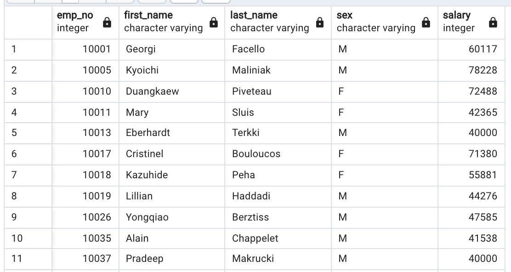
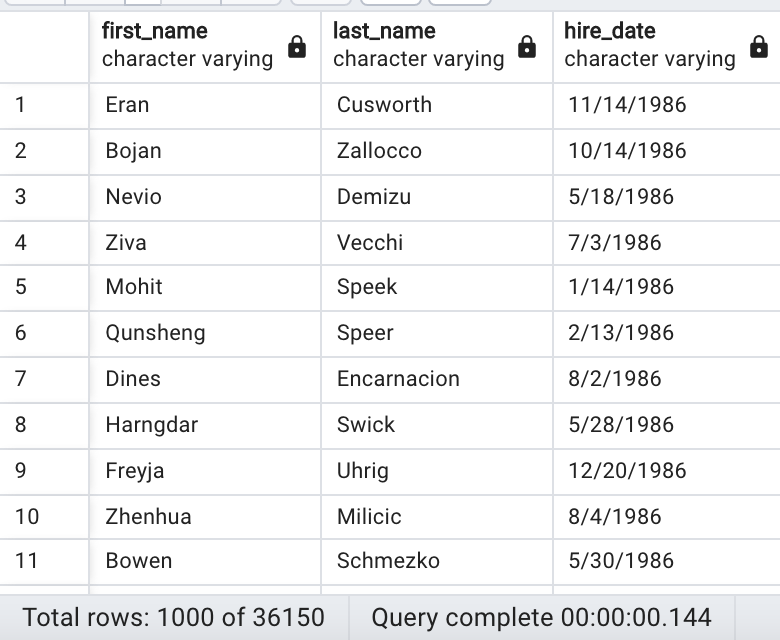
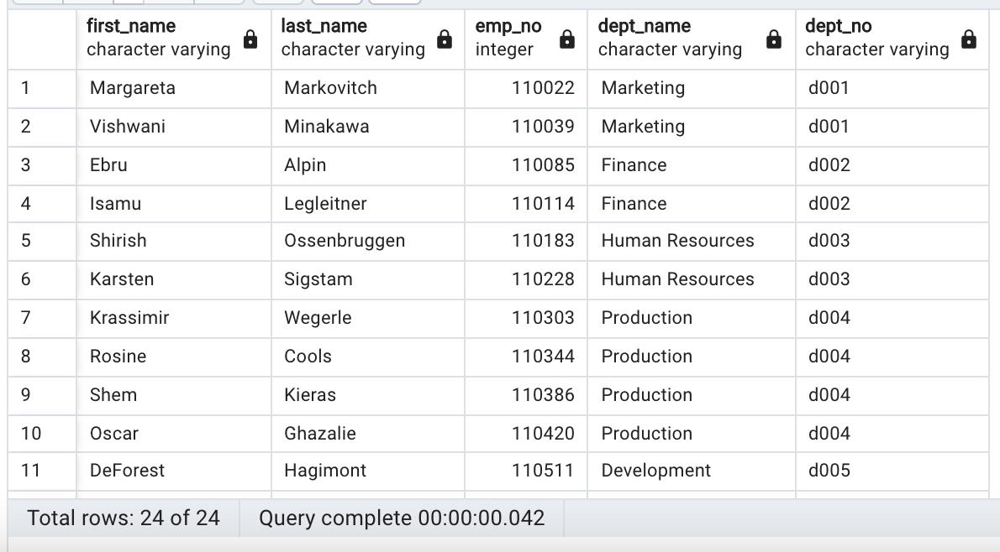
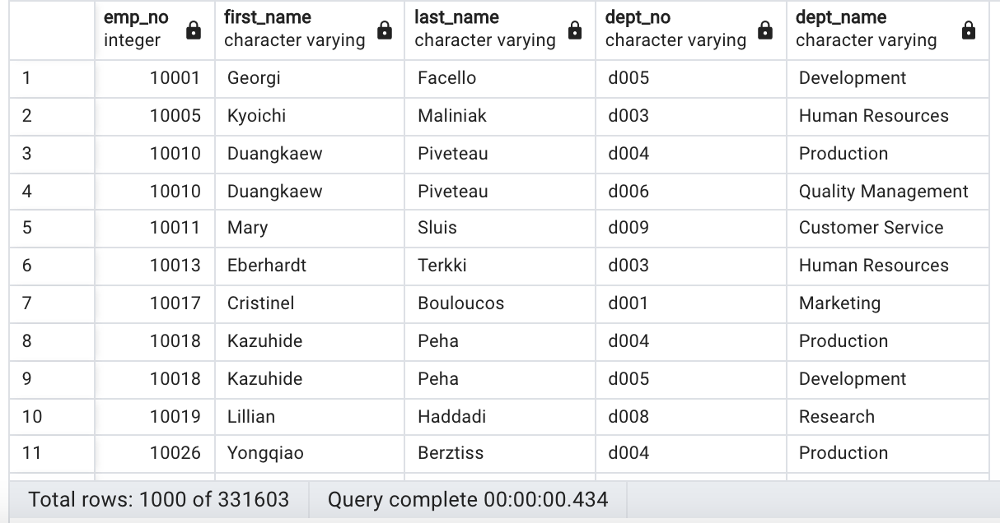
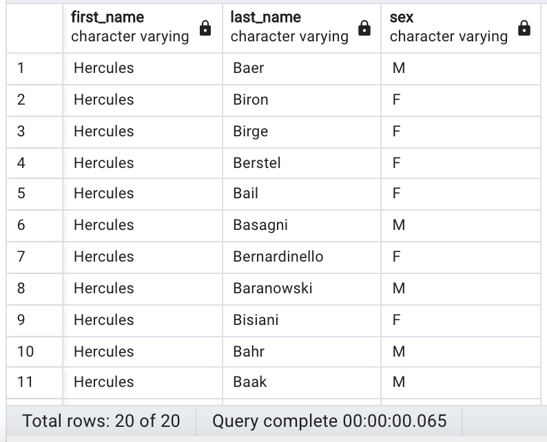
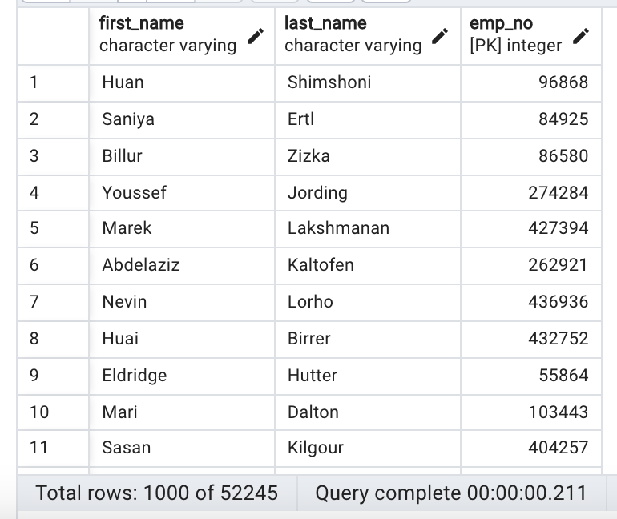
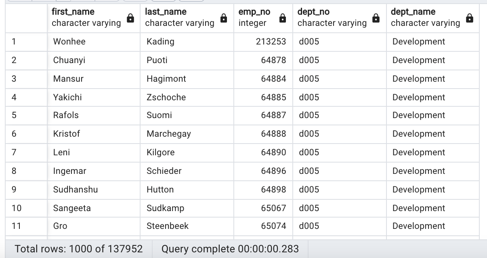
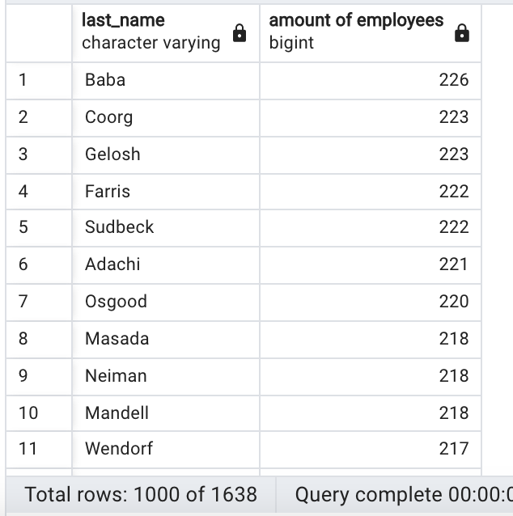

# sql-challenge
For this assingment we got 6 different CSV files. We created an ERD to map out how we were going to connect each of the tables to be able to do queries to solve different questions. 
CHALLENGE9_ERD.png
After this we created a table schema to relate each of the tables to be able to query through all of them using primary keys and foreign keys as needed. 
Then we imported the CSV files into their respective tables (created in the table schema).

After that we did different queries to answer the following (queries' preview attached) :

    Q1.List the employee number, last name, first name, sex, and salary of each employee.
    

    Q2.List the first name, last name, and hire date for the employees who were hired in 1986.

    Q3.List the manager of each department along with their department number, department name, employee number, last name, and first name.

    Q4.List the department number for each employee along with that employees employee number, last name, first name, and department name.

    Q5.List first name, last name, and sex of each employee whose first name is Hercules and whose last name begins with the letter B.

    Q6.List each employee in the Sales department, including their employee number, last name, and first name.

    Q7.List each employee in the Sales and Development departments, including their employee number, last name, first name, and department name.

    Q8.List the frequency counts, in descending order, of all the employee last names (that is, how many employees share each last name).

  